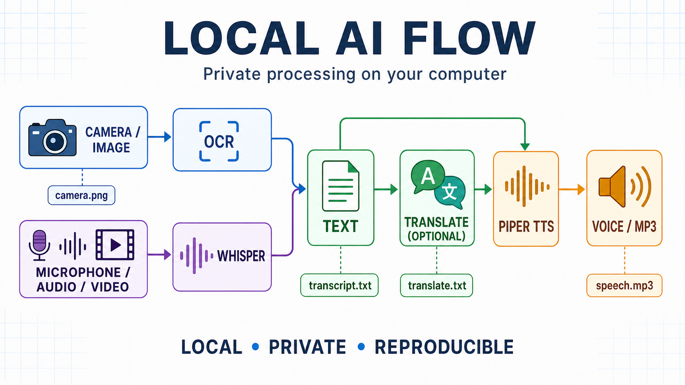

# ollama_api


`ollama_api` is a local command-line workflow for Ollama. Its main command,
`cli_ollama.py`, runs typed prompt, translation, image OCR, and image-description
tasks through one shared configuration and one consistent logging mechanism.



## Requirements

- Python 3.10 or newer
- [Ollama](https://ollama.com/) running locally or reachable at the URL configured
  in `lib/ollama.json`
- Python packages from `requirements.txt`

Create and activate a virtual environment before installing the dependencies.

```powershell
# Windows PowerShell
py -3 -m venv venv
.\venv\Scripts\Activate.ps1
python -m pip install --upgrade pip
python -m pip install -r requirements.txt
```

```bash
# Linux and macOS
python3 -m venv venv
source venv/bin/activate
python -m pip install --upgrade pip
python -m pip install -r requirements.txt
```

Install the models used by the supplied task files:

```bash
ollama pull deepseek-coder-v2:latest (8.9 GB)
ollama pull translategemma:12b       (8.1 GB)
ollama pull deepseek-ocr:3b          (6.7 GB)
ollama pull qwen3.5:latest           (6.6 GB)
ollama pull gpt-oss:latest           (13 GB) 
```

Run commands from the repository root.

## Quick start

```bash
# Verify the configured server, its API endpoints, and installed models.
python cli_ollama.py --test

# Print the available local models.
python cli_ollama.py --list

# Run a prompt task.
python cli_ollama.py --type task_test.json
```

`--test` does not load a model. It reports the configured URL, DNS resolution,
HTTP responses from Ollama, the installed-model list, and a safe probe of the
generate endpoint. Use it first when a task cannot connect or reports HTTP 404.

## Configuration and files

`project.json` selects the active project directory and controls logging:

```json
{
  "subdir": "project_test260726",
  "log": true,
  "debug": false,
  "db": true,
  "selector": "test123",
  "ollama_timeout_seconds": 900
}
```

All task inputs and outputs are directly inside this directory. With the example
above, they are in `project_test260726/`. When `log` is `true`, terminal output
from `cli_ollama.py`, including `--test` and `--list`, is appended to
`project_test260726/log.txt`. Task runs also record a compact two-line summary
of the effective model and generation options; command-line overrides are
explicitly marked.

With `"db": true`, each successfully completed `cli_ollama.py` task stores its
final response in `data/tasks.db`. Model thinking and diagnostic output are not
stored. Set `"db": false` to disable this history. Database browsing, filters,
exports, and merging are documented in [data/tasks_db.md](data/tasks_db.md).

To prepare text for later task input, run
`python cli_ollama.py --merge first.txt second.txt [result.txt]`.
The second merge value may also be literal text, and omitting `result.txt` writes
`merged.txt` in the active project directory.

The shared server address and default generation options are in
`lib/ollama.json`. The optional `debug` switch uses this precedence:
`lib/ollama.json` → `project.json` → selected `tasks_flows/task_*.json`. With
`"debug": false` in `project.json`, normal task output and runner flow output
omit diagnostic detail and timestamps, while duration markers remain visible; a
task can explicitly set `"debug": true` when detailed diagnostics are needed.
Task files define one operation each:

| Task file | Purpose |
| --- | --- |
| `task_test.json` | Generic text prompt |
| `task_translate.json` | Czech/English translation |
| `task_script.json` | Generate a simple script with a reusable programming skill |
| `task_ocr.json` | OCR from an image |
| `task_describe.json` | Image description |

All listed task files are stored in `tasks_flows/`; pass only the filename to
`--type`.

Source code and JSON configuration use UTF-8 without BOM. Generated user-facing
text files, transcripts, and newly created logs use UTF-8 with BOM so that older
Windows tools detect their encoding automatically. Text inputs accept UTF-8
with or without BOM.

### Prompt input, rules, context, profiles, and capabilities

A task request now has explicit input layers. Everything except generation
options becomes part of the model's context window, but the CLI keeps the
sources distinct while it compiles the request:

| Configuration | Meaning | Ollama request field |
| --- | --- | --- |
| `prompt` in a task, or `--input TEXT|FILE` / legacy `--data` | Current data or question. The CLI value replaces the task `prompt`. | `prompt` or user chat message |
| `instruction` in a task | Base task rules, output format, and constraints. | `system` or system chat message |
| `--rules TEXT|FILE` | Additional runtime rules; repeating the option appends them in order. | appended to `system` |
| `--replace-rules TEXT|FILE` / legacy `--instruction` | Explicitly replaces base task rules before `--rules` are appended. | `system` |
| `--context FILE` | Project-local reference material. Repeating the option appends files in order, enclosed in `[REFERENCE FILE: name]` boundaries. | labelled prompt/user content |
| `profile` or `profiles` in a task; `--profile ID` | Stable role, language, style, and long-lived behavioral rules. An ID such as `teacher_cz` resolves to `assistant/profiles/teacher_cz.md`. | beginning of `system` |
| `capability` or `capabilities` in a task; `--capability ID` | Reusable work procedure or expertise. An ID such as `programmer` resolves to `assistant/capabilities/programmer.md`. | after profiles in `system` |

The effective order is:

```text
task profiles -> CLI profiles -> task capabilities -> CLI capabilities
-> task/replaced rules -> slash-command rules -> appended --rules
                                     = system context

# Reference context -> [REFERENCE FILE: reference-a.md] -> [END REFERENCE FILE]
                       -> [REFERENCE FILE: reference-b.md] -> [END REFERENCE FILE]
# Current input -> [INPUT] -> current prompt -> [END INPUT]
                                     = user/prompt context (Markdown structure)
```

The new task fields are `profile`/`profiles` and `capability`/`capabilities`.
Legacy `skill`/`skills` fields and paths such as `./skills/programmer.md` remain
accepted as aliases during migration. Missing task components retain the old
optional behavior and are ignored. A profile or capability explicitly requested
through the CLI is an error when missing, which makes typographical errors
visible.

The assistant assets are grouped by their purpose:

```text
assistant/
  profiles/       stable roles and personas
  capabilities/   reusable procedures and expertise
  commands/       slash-command catalog (sc.json)
```

`--dry-run` prints the fully compiled Ollama JSON request and does not contact
the server or write task output. Image dry-runs include the Base64 image data,
so their output may be very large.

### Slash commands

`assistant/commands/sc.json` contains reusable action and formatting presets. Select one working
language with `--sc-cz` or `--sc-en`, then add one or more commands with
repeated `--sc NAME`. The language-neutral `/ocr` command is the exception and
can be used without a language selector:

```powershell
python cli_ollama.py --type task_base.json `
  --sc-cz `
  --sc summarize `
  --sc bulletpoints `
  --sc brief `
  --input article.txt `
  --dry-run
```

The command names are lookup keys and are not inserted literally into the
model context. The matching Czech or English rules from `assistant/commands/sc.json` are appended
after task rules and before `--rules`; a final rule requires output only in the
selected language. `--sc-cz` without a command selects the internal default
`explain` key and only adds the Czech-language requirement.

Only one primary action or artifact is allowed in one request. Format and style
modifiers such as `bulletpoints`, `table`, `brief`, `examples`, or `human` can
be combined. The CLI rejects ambiguous stacks such as `--sc summarize --sc email`
or two persona modifiers such as `--sc expert --sc ceo`.

Slash-command language does not translate the input. Keep translation explicit
in a flow: translate Czech input to English before an `--sc-en` task, or
translate English input to Czech before an `--sc-cz` task. A final translation
step can convert the generated result to the required delivery language.

```json
{
  "model": "qwen3.5:latest",
  "capability": "programmer",
  "instruction": "Write a simple HTML and JavaScript script.",
  "prompt": "Create a multiplication practice page."
}
```

### Compatibility notes for existing flows

Existing `tasks_flows/flow*.txt` files are unchanged. Their `--data` and
`--instruction` arguments remain supported with their former meaning, so the
following current flows remain operational without edits:

- `flow_voice_free.txt`, `flow_voice_sky.txt`, `flow_freestyle.txt`, and
  `flow_base.txt` use `task_base.json` with `--data`; `--input` is only a
  clearer alias for a future rewrite.
- `flow_cam_describe.txt`, `flow_bwp.txt`, and `flow_ocr_test.json` use the
  image and translation defaults without the new context options.
- `flow_voice_holly_pivo.txt` and `flow_voice_cotoje12.txt` retain the
  important legacy behavior: `--instruction` replaces the task instruction
  while the task profile remains before it.

There are two intentional semantic extensions to check before adopting the new
options in existing automation:

1. `--rules` appends to task rules; it is not a rename of `--instruction`.
   Use `--replace-rules` when replacement is intentional.
2. Skills and rules are now sent for OCR and image-description tasks too. An
   old image task containing `skill` or `instruction` previously ignored those
   fields; it will now use them. The bundled image tasks do not contain either
   field.

`flow_html_cz.txt` exposes an older task-design issue rather than a CLI break:
`--data html_fotos_cz.txt` replaces the static `task_html.json` prompt
(`"vytvoř pouze webovou stránku html…"`). Its accompanying
`--instruction html_cz.md` supplies the runtime specification. A later task
schema migration should move the static HTML requirement into task rules, so it
survives independently of `--input`.

## Camera and microphone

The optional camera and microphone commands use the active project directory
from `project.json`. With logging enabled, their diagnostic output is appended
to that project's `log.txt`.

### Camera capture

```bash
# Capture camera index 0 into <active-project>/camera.png.
python cli_camera.py --camera 0
```

The preview is displayed at twice the captured frame size. On Windows the
command uses the DirectShow backend. On Linux it first uses V4L2 and then falls
back to OpenCV's default backend. Run it from a graphical Linux session with
access to the relevant `/dev/videoN` device; if needed, select a different
device with `--camera 1`.

### Microphone recording

```bash
# Record the default microphone to <active-project>/record.mp3.
python cli_record_mp3.py

# Choose a filename and override software gain.
python cli_record_mp3.py interview.mp3 --gain-db 4

# List microphones, then explicitly select the correct input device.
python cli_record_mp3.py --list-devices
python cli_record_mp3.py --device 2
```

The command uses the operating system's default input device unless `--device`
is provided. Press any key to stop recording on Windows or Linux, or use Ctrl+C.
During recording it displays the input peak level; a `silence` or very low level
means that the wrong microphone is selected or its system-level input
volume/mute needs attention. The configured software gain amplifies an existing
signal but cannot repair a muted or wrong input device. On Linux it must run in
an interactive terminal. The bundled FFmpeg configuration is used on Windows;
on Linux, if that Windows path is unavailable, the command automatically uses a
system `ffmpeg` found on `PATH`. Ensure FFmpeg and the system PortAudio library
are installed through your distribution's package manager.

### Speech synthesis

```bash
# Play Czech speech from the active project.
python cli_speech.py -cz

# Play English speech from the active project.
python cli_speech.py --en

# Play Spanish speech from the active project.
python cli_speech.py --es

# Speak text passed directly on the command line.
python cli_speech.py -en "have a nice day"

# Select any other configured voice.
python cli_speech.py -cz --voice honza
python cli_speech.py -en --voice joe "have a nice day"

# Override a configured speed for this run (higher value speaks slower).
python cli_speech.py -cz --voice honza "Jedna dva tři" --speed 1.5

# Read a text file from the active project.
python cli_speech.py --cz translate.txt

# Also create <active-project>/translate.mp3.
python cli_speech.py --cz translate.txt --mp3 translate.mp3
```

Without an input argument, `-cz`/`--cz` reads `text_cz`, `-en`/`--en` reads
`text_en`, and `-es`/`--es` reads `text_es` from `cli_speech.json`. A positional
argument ending in `.txt` is read from the active project directory; every other
value is spoken directly.

`-cz` and `-en` choose the first configured voice with that language and an
available model, in the order written in `cli_speech.json`; with the supplied
order, this is Jirka for Czech and Alan for English. Use `--voice NAME` to
choose a particular configuration key, for example `--voice alan`. Any
configured voice can speak any command-line text or `.txt` file; combining a
language switch with another voice is allowed.

Each voice has a `length_scale` in `cli_speech.json`. `--speed SCALE` overrides
it for one command; a higher scale produces slower speech.

The configured Piper models must be present in `assets/`, including the adjacent
`.onnx.json` metadata file. The standard Czech configuration expects
`assets/cs_CZ-jirka-medium.onnx`; if it is missing, restore that model from the
project distribution, or download it from the repository root:

```bash
cd assets
python -m piper.download_voices cs_CZ-jirka-medium
cd ..
```

Alternatively, change the `"model"` path for `cz` in `cli_speech.json` to an
installed Piper model. MP3 creation is enabled only with `--mp3 NAME.mp3` and
the output name must be directly inside the active project directory. It works
on Linux and macOS as well as Windows. With `"sound": true`, live playback uses
the first available system player:
`pw-play`, `paplay`, `aplay`, `ffplay`, or `mpv` on Linux. If none is installed,
the MP3 is still created and the command prints an installation hint.

## `cli_ollama.py` reference

```text
python cli_ollama.py [options]
```

| Option | Description |
| --- | --- |
| `--type TASK.json` | Task configuration in `tasks_flows`. Required to run a task. |
| `--project DIRECTORY` | Select and save the active project directory, then exit. |
| `--debug true\|false` | Save the project's `debug` setting for subsequent CLI commands, then exit. |
| `--selector TEXT` | Save the project's task-record `selector`, then exit. `--setector` is an accepted alias. |
| `--clrlog`, `--clear_log` | Clear the active project's `log.txt`, then exit. |
| `--echo MESSAGE` | Print a yellow standalone message; it is appended to `log.txt` when project logging is enabled. |
| `--input TEXT\|FILE`, `--data TEXT\|FILE` | Current prompt input for a generic prompt task. `--data` is the legacy alias. |
| `--rules TEXT\|FILE` | Append runtime rules; may be repeated and works for every task type. |
| `--replace-rules TEXT\|FILE`, `--instruction TEXT\|FILE` | Replace task rules. `--instruction` is the legacy alias. |
| `--context FILE` | Append a UTF-8 reference file from the active project; may be repeated. The compiled prompt separates it as `# Reference context`, `[REFERENCE FILE: <name>]`, then `# Current input` with `[INPUT]`. |
| `--profile ID` | Append `assistant/profiles/ID.md`; may be repeated. |
| `--capability ID` | Append `assistant/capabilities/ID.md`; may be repeated. |
| `--skill ID` | Legacy lookup: searches `assistant/capabilities/ID.md` and then `assistant/profiles/ID.md`; may be repeated. |
| `--sc-cz`, `--sc-en` | Select Czech or English slash-command rules and require output only in that language. |
| `--sc NAME` | Append a compatible slash command from `assistant/commands/sc.json`; may be repeated and normally requires `--sc-cz` or `--sc-en` (`/ocr` is language-neutral). |
| `--dry-run` | Print the fully resolved Ollama JSON request without contacting Ollama. |
| `--in FILE` | Input file for translation, OCR, or image-description tasks. |
| `--out RESULT.txt` | Output text file in the active project directory; overrides a task's `default_output_file`. |
| `--append-out` | Append a prompt response to `--out` or the task's `default_output_file`; useful for a matrix report. |
| `--out-header TEXT` | Write a short heading immediately before a prompt response in its output file. |
| `--clear-out RESULT.txt` | Empty an output `.txt` file in the active project directory, then exit. |
| `--model MODEL` | Override the model specified by the task. |
| `--seed SEED` | Override the Ollama random seed. A value of `0` generates a random seed, equivalent to `--seed_rnd`. |
| `--seed_rnd` | Generate and use a random Ollama seed from 1 to 999999. Cannot be combined with `--seed`. |
| `--temp TEMPERATURE` | Override temperature; must be zero or greater. |
| `--num-predict TOKENS` | Override the maximum generated-token count. |
| `--num-ctx TOKENS` | Override the context-window size. |
| `--repeat-penalty VALUE` | Override the repetition penalty. |
| `--c2a`, `-c2a` | Translate Czech to English. Translation tasks only. |
| `--e2c`, `-e2c` | Translate English to Czech. `--a2c` is a legacy alias. |
| `--status`, `-s` | Show the active project, shared Ollama, and selected task configuration. |
| `--test` | Verbose Ollama connectivity and endpoint diagnostic. |
| `--list` | List available models in compact three-line blocks with size, parameters, quantization, context, embeddings, capabilities, and metadata. |
| `--version`, `-v` | Show program and wrapper versions. |
| `--help`, `-h` | Show command help. |

`--project`, `--debug`, `--selector`, `--clrlog`, `--echo`, `--status`, `--test`, and `--list` are standalone
actions. They do not require a task file; all other commands require `--type`.
`--test` and `--list` cannot be combined with each other.

Use `--debug true` or `--debug false` to persist the value in `project.json`.
The next `cli_*` command in a flow reads that project setting, so a flow can
change its diagnostic level before subsequent steps.

Use `--selector test123` (or the compatible alias `--setector test123`) to
persist the task-record selector in `project.json` before later flow steps.

## Examples

### Generic prompt

```bash
# Use task_test.json and its prompt.
python cli_ollama.py --type task_test.json

# Replace the prompt with project_test260726/test.txt.
python cli_ollama.py --type task_test.json --data test.txt

# Replace the task instruction with project_test260726/five_words.txt.
python cli_ollama.py --type task_test.json --instruction five_words.txt

# Pass the prompt and instruction directly.
python cli_ollama.py --type task_test.json --data "jablko" --instruction "jen napiš jedno slovo ze vstupu"

# Override the model and sampling settings.
python cli_ollama.py --model qwen3.5:latest --temp 0.2 --num-predict 512
```

### Translation

```bash
# Czech to English. Uses the task's default Czech input file and translate.txt.
python cli_ollama.py --type task_translate.json --c2a

# English to Czech with explicit input and output files.
python cli_ollama.py --type task_translate.json --e2c --in source_en.txt --out result_cs.txt
```

### OCR and image description

```bash
# Extract text from an image.
python cli_ollama.py --type task_ocr.json --in camera.png --out camera.txt

# Describe an image.
python cli_ollama.py --type task_describe.json --in camera.png --out description.txt
```

Supported image formats are PNG, JPEG, WEBP, BMP, and GIF. The input image and
output text file must be directly inside the active project directory.

## Flow runner

`runner.py` executes a validated list of project commands from a flow file and
stops at the first non-zero exit code. Each executed command, including its
effective Python executable and all parameters, is written to the terminal and
to `log.txt` when logging is enabled.

Without a flow-file argument it looks for `flow_test.txt` in this order: the
repository root, the active project directory configured in `project.json`,
then `./tasks_flows`.

```bash
# Run the first matching default flow.txt.
python runner.py

# Validate a flow without running it.
python runner.py project_test260726/flow_proj.txt --dry-run

# Run the flow.
python runner.py project_test260726/flow_proj.txt
```

See `flow_ollama.txt` and `project_test260726/flow_proj.txt` for complete
examples of prompt, OCR, translation, and image-description stages.

### Parameter matrix (JSON flow)

For repeated runs, use a JSON flow instead of embedding loop syntax in a shell
command. Its arguments are an explicit JSON array, so paths and values with
spaces do not need shell quoting. A step's optional `matrix` creates the
Cartesian product of its named value arrays; `{name}` inserts the current
value. The runner validates all expanded commands before it starts a run.

```bash
# Inspect the five expanded temperature runs without calling Ollama.
python runner.py tasks_flows/flow_temperature_matrix.json --dry-run

# Run them.
python runner.py tasks_flows/flow_temperature_matrix.json
```

The supplied example expands to five `cli_ollama.py` calls. It also uses the
temperature in `--out`, preventing each result from overwriting the previous
one:

```json
{
  "version": 1,
  "steps": [
    {
      "run": "cli_ollama.py",
      "args": ["--type", "task_base.json", "--temp", "{temp}", "--out", "task_base_temp_{temp}.txt"],
      "matrix": {"temp": [0.1, 0.3, 0.5, 0.7, 0.9]}
    }
  ]
}
```

For example, adding `"seed": [1, 2]` to `matrix` and `"--seed", "{seed}"`
to `args` runs every temperature/seed combination. JSON flows and existing
`.txt` flows can be used side by side.

To aggregate a matrix into one compact report, clear the report first and use
`--append-out` plus an expanded header. The supplied
`flow_seed_temp_matrix.json` writes entries such as `[seed: 1] [temp: 0.1]`
followed by the response to a new file such as
`project_matrix/task_answers_260727_1126.txt`.

JSON flows also provide `{run_timestamp}`, formatted as `YYMMDD_HHMM`. It is
calculated once when the flow starts, so every step in that run uses the same
report filename while later runs create a separate report.

`flow_model_seed_temp_matrix.json` demonstrates a three-dimensional matrix:
two models, three temperatures, and five seeds produce 30 labelled answers in
one timestamped report.

### Conditional flow (JSON version 2)

JSON flow version 2 adds a small, safe `if` branch. At runtime the runner
checks a file in the active project directory and executes either `then` or
`else`; both paths are validated before the flow starts. The first version
supports `file_exists` and `file_not_empty`. It deliberately does not execute
shell expressions or arbitrary Python.

```bash
# Put camera.png in the active project directory, then inspect the whole flow.
python runner.py tasks_flows/flow_ocr_test.json --dry-run

# Run OCR. A non-empty OCR result is translated; otherwise the fallback note runs.
python runner.py tasks_flows/flow_ocr_test.json
```

The supplied `flow_ocr_test.json` illustrates the structure:

```json
{
  "version": 2,
  "steps": [
    {"run": "cli_ollama.py", "args": ["--type", "task_ocr.json", "--in", "camera.png", "--out", "ocr_test.txt"]},
    {
      "if": {"file_not_empty": "ocr_test.txt"},
      "then": [{"run": "cli_ollama.py", "args": ["--type", "task_translate.json", "--c2a", "--in", "ocr_test.txt"]}],
      "else": [{"run": "cli_ollama.py", "args": ["--echo", "OCR has no usable text."]}]
    }
  ]
}
```

The condition path must be relative to, and remain inside, the active project
directory. In `--dry-run`, the runner validates and displays both branches;
it does not choose a branch because the preceding OCR command is not executed.

When Ollama explicitly reports `model 'name' not found`, the affected task is
logged as skipped and the runner continues with the next flow step. Other
non-zero exit codes still stop the flow.

To print a standalone yellow note without running a task (and append it to the
active project's log when project logging is enabled):

```bash
python cli_ollama.py --echo "yellow warning 123"
```

## Other utilities

The repository also contains optional camera, microphone, Whisper, Piper, and
[MCP utilities](mcp/mcp.md). The Ollama prompt, translation, OCR, and image-description
operations are consolidated in `cli_ollama.py`; the former standalone Python
scripts for these operations have been removed.

## Troubleshooting

Start with:

```bash
python cli_ollama.py --test
python cli_ollama.py --list
```

If a task reports HTTP 404, inspect the response body. A message such as
`model 'name' not found` means the server is reachable but that model has not
been installed on this machine. Install it with:

```bash
ollama pull name
```
