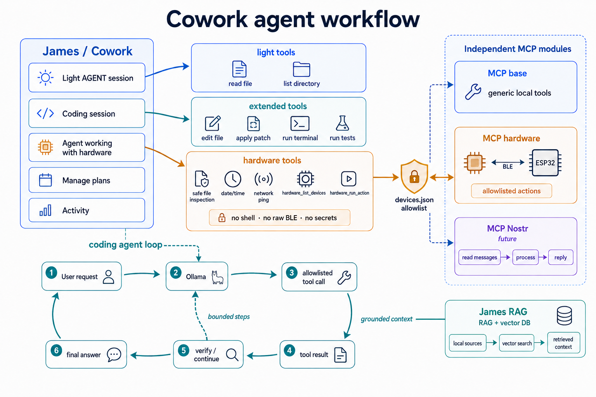

# Agents in James

This directory documents the agent-oriented workflow in this repository. James
is the local terminal host: it starts a scoped agent session, supplies only the
tools chosen for that session, records the result through the normal local
workflow, and keeps interactive choices local to the running Cowork session.



For the James menu as a whole, see [James README](../james/README.md). The
larger Cowork roadmap is [todo_cowork_cz.md](../james/todo_cowork_cz.md), and
the broader agent backlog is [todo_agent_cz.md](../assistant/spec/todo_agent_cz.md).

## Current agent profiles

Cowork reads the declarative profiles in [james/agents.json](../james/agents.json).
Each profile chooses a label, Ollama model, generation options, and a named
tool profile. Options omitted from a profile inherit from
[cli_agent.json](../cli_agent.json).
An optional profile field `think` accepts `true`, `false`, `low`, `medium`, or
`high` and is forwarded to Ollama independently of generation options. If a
server rejects an explicit setting, the session retries once without it.

- **Light AGENT session** is intended for short local assistance with a small,
  general-purpose tool set.
- **Coding session** uses the extended tool set for project analysis, edits,
  and local verification. It keeps the larger coding context window.
- **Agent working with hardware** is a deliberately restricted local agent for
  configured external hardware plus safe project inspection and diagnostics.
  It can obtain local date/time and run the fixed network diagnostic, but it
  cannot open a shell, execute arbitrary Python, read `.env`, or issue raw BLE
  commands.

The shared Coding and Light-agent instructions are in
[cowork_coding.txt](cowork_coding.txt). The hardware agent uses
[mcp_hardware.txt](mcp_hardware.txt). The Nostr profile combines the common
policy in [mcp_nostr.txt](mcp_nostr.txt) with bounded chat and polling rules in
[mcp_nostr_chat.txt](mcp_nostr_chat.txt). James and `cli_agent.py` read the
shared Coding instructions from the same document.

The exact tool definitions and profile membership are the source of truth in
[assistant/tools/tool_schema.json](../assistant/tools/tool_schema.json). The
runtime implementation is [lib/wrapp_agent.py](../lib/wrapp_agent.py).

## Agent loop

An agent session follows a bounded local loop:

```text
user request
  -> selected Cowork profile and system instructions
  -> local Ollama response
  -> zero or more allowlisted tool calls
  -> tool results returned to the model
  -> final answer and local run record
```

The loop has a maximum step count and a tool policy. A tool result is evidence,
not an instruction: the model must continue only from the user's request and
the trusted local tool contract. Coding sessions may use editing and
verification tools according to their policy. Hardware sessions avoid automatic
continuation and review passes because another physical action must not be
silently repeated.

Session settings such as selected model, project, tool policy, and recent turns
exist only while Cowork is open. The profile files remain the reusable starting
configuration for the next session.

## MCP services and agent tools

MCP services are independent local modules, not an unrestricted back door into
an agent session. James exposes them under **MCP base**, **MCP hardware**, and
**MCP Nostr**. A missing optional module reports the files to install or add
and does not stop James or other modules.

The hardware MCP server is [mcp/hw_mcp_server.py](../mcp/hw_mcp_server.py) with
[mcp/hw_server.json](../mcp/hw_server.json). It provides only two named tools:

- `hardware_list_devices` returns the public device/action catalog without
  connecting to hardware.
- `hardware_run_action(device_id, action_id)` validates both names against
  `devices.json` and runs exactly one agent-enabled action.

The hardware Cowork profile uses the same allowlist layer as this MCP server;
it is intentionally not given a generic MCP client, shell, raw BLE writer,
UUID, payload, device address, or secret. That keeps a single capability
boundary for manual BLE diagnostics, MCP, and agent work. The detailed design,
test history, and safety checklist are in
[agent_mcp_hw_cz.md](../assistant/spec/agent_mcp_hw_cz.md).

For the Base MCP service and command-line testing, see
[mcp/mcp.md](../mcp/mcp.md), [mcp/mcp2_cz.md](../mcp/mcp2_cz.md), and
[cli_mcp.py](../cli_mcp.py). MCP configuration and dependency management stay
separate from the agent profile so that a new clone can use Light or Coding
sessions even when optional BLE or future Nostr support is absent.

## Working principles

- Prefer the smallest profile that can complete the requested work.
- Treat `tool_schema.json` and `devices.json` as capability boundaries, not as
  prompts for the model to work around.
- Let explicit, named actions express external side effects; do not infer raw
  transport commands from project files or user prose.
- Keep secrets local. Agent file tools reject `.env` sources, and hardware/MCP
  results do not return authentication values.
- Use RAG for retrieved local document context and MCP for separately hosted
  capabilities. They complement the agent loop but do not replace its tool
  policy.

For the RAG workflow, see [rag_wiki/cli_vector.md](../rag_wiki/cli_vector.md)
and the RAG section of [James README](../james/README.md#rag).
