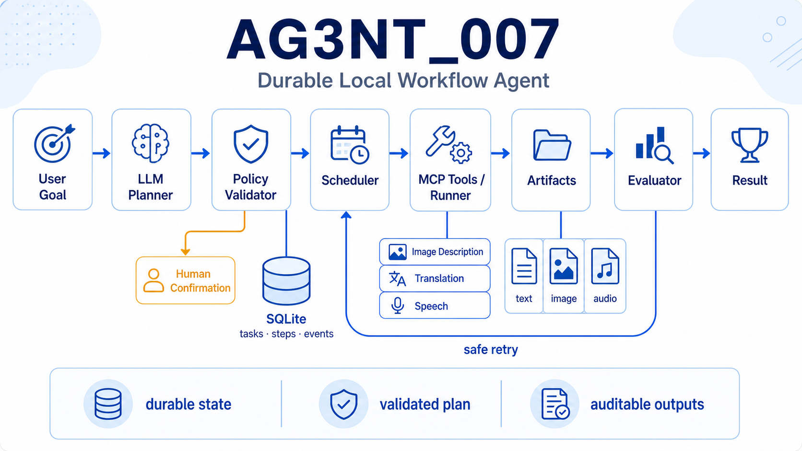
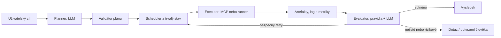

# Návrh workflow agenta nad runnerem a MCP

[](agent1.png)

## 1. Cíl

Vytvořit lokálního **workflow agenta**, který přijme cíl v přirozeném jazyce,
rozloží jej na omezené a ověřitelné kroky, předá je existujícím nástrojům a
vyhodnotí jejich výsledek. Agent nemá být volně běžící „AI se shellem“. Má být
řídicí vrstvou nad současným `runner.py`, `cli_ollama.py` a MCP nástroji.

Rozdělení odpovědností:

| Vrstva | Odpovědnost | Co nesmí dělat |
| --- | --- | --- |
| Agent / planner | Určí plán z uživatelského cíle a vybere schopnost. | Přímo spouštět příkazy nebo libovolně číst disk. |
| Policy validátor | Povolit či zamítnout plán, parametry a rizikové akce. | Přepisovat význam úkolu podle vlastního uvážení. |
| Scheduler | Udržet stavy úloh, návaznosti, timeouty a retry. | Vymýšlet další práci. |
| Executor | Spustit předem povolený MCP nástroj nebo validovaný flow. | Přijímat nevalidovaný shellový text od modelu. |
| Evaluátor | Ověřit artefakty a kvalitu výstupu. | Potichu označit neověřený výstup za úspěch. |

Stávající `runner.py` je vhodným základem executorové vrstvy: již omezuje flow
na Python CLI v kořeni repozitáře a validuje jejich strukturu. MCP má být
standardní katalog jemnějších schopností; agent je jeho klient, nikoli server.

## 2. Co znamená „agent“ v tomto projektu

Agent není samostatná osobnost ani náhrada programové logiky. Je to řízená
smyčka:

1. převezme cíl a dostupný kontext;
2. vytvoří **strukturovaný plán**;
3. validátor povolí pouze bezpečné kroky;
4. scheduler provede připravené kroky;
5. evaluator změří, zda je cíl nebo mezikrok splněn;
6. agent buď podá výsledek, nebo navrhne omezenou opravu.

Model tedy rozhoduje hlavně o *co* a *proč*, kdežto deterministický kód
rozhoduje o *zda smí* a *jak se krok technicky provede*.



## 3. Preferovaný technický směr

### 3.1 Stav je trvalý, socket je jen doprava zpráv

Sockety jsou vhodné pro předání informace „nová úloha“ nebo „krok skončil“, ale
nejsou vhodným jediným uložištěm stavu: spojení může spadnout, proces se může
restartovat a zpráva se může doručit dvakrát.

První verze proto má používat:

- **SQLite** jako zdroj pravdy pro úlohy, kroky, pokusy a výsledky;
- **adresář artefaktů** v projektu pro text, obraz, audio a JSON výstupy;
- **JSONL event log** pro čitelnou historii;
- `asyncio.Queue` uvnitř procesu jako pracovní frontu.

Pozdější víceprocesová verze může queue nahradit lokálním ZeroMQ nebo Redisem.
Přechod má zachovat stejnou datovou obálku, aby se neměnila logika agenta.

### 3.2 SQLite jako registr úloh a zdroj pravdy

Pro první lokální verzi je SQLite doporučená databáze. Nepotřebuje samostatný
server, je transakční, snadno se zálohuje spolu s projektem a pokryje běžný
scénář jednoho scheduleru s několika lokálními workery. Databáze není náhradou
za adresář artefaktů: velké obrazy, audio a dlouhé texty zůstávají v projektu;
SQLite ukládá jejich cestu, velikost, hash a vazbu na krok.

Minimální návrh tabulek:

| Tabulka | Hlavní obsah |
| --- | --- |
| `tasks` | `task_id`, uživatelský cíl, projekt, priorita, celkový stav, rozpočet retry, čas vytvoření. |
| `plans` | Původní návrh LLM, schválený normalizovaný plán, verze schématu a policy verdict. |
| `steps` | `step_id`, capability, vstupní JSON, stav, závislosti, pořadí, timeout a `lease_until`. |
| `attempts` | Číslo pokusu, worker, začátek/konec, návratový kód, chyba, metriky a použitý model. |
| `artifacts` | Cesta relativní k projektu, typ, hash, velikost, producent a stav validace. |
| `events` | Neměnná auditní stopa: čas, typ události, `task_id`, `step_id`, data v JSON. |

Scheduler si musí další krok převzít atomicky v krátké transakci: vybere pouze
`queued` krok se splněnými závislostmi, změní jej na `running`, přidělí
`lease_until` a vytvoří `step_started` event. Worker během práce lease obnovuje.
Pokud worker nebo proces spadne, scheduler po vypršení lease rozhodne podle
idempotence capability, zda krok vrátí do fronty, nebo jej označí
`needs_human`.

Pravidla provozu:

- použít SQLite journal mode `WAL`, aby dashboard či CLI mohly číst stav během
  zápisu;
- držet transakce krátké; inference, MCP volání a práci se soubory nikdy
  nedělat uvnitř transakce;
- při dokončení kroku transakčně uložit výsledek, artefakty, nový stav a event;
- využít unikátní omezení nad `(task_id, step_id, attempt)` a idempotency key,
  protože zpráva může být doručena opakovaně;
- přes `PRAGMA foreign_keys = ON` chránit vazby task → step → attempt;
- databázi pravidelně zálohovat nebo exportovat do čitelného JSONL logu.

Pokud by později workeři běželi na více počítačích nebo by zátěž vyžadovala
velký počet souběžných zápisů, SQLite lze nahradit PostgreSQL. Eventová obálka
a logika scheduleru by se přitom neměly změnit.

### 3.3 Typy zpráv

Každá událost musí obsahovat alespoň `task_id`, `step_id`, čas, verzi a stav.

```json
{
  "event": "step_completed",
  "event_version": 1,
  "task_id": "task-20260727-001",
  "step_id": "describe_image",
  "attempt": 1,
  "status": "succeeded",
  "artifacts": ["project_x/describe.txt"],
  "metrics": {"duration_s": 12.4},
  "created_at": "2026-07-27T14:30:00+02:00"
}
```

Minimální sada událostí:

- `task_created`, `plan_proposed`, `plan_approved`, `plan_rejected`;
- `step_queued`, `step_started`, `step_completed`, `step_failed`;
- `evaluation_requested`, `evaluation_completed`;
- `task_completed`, `task_failed`, `task_needs_confirmation`.

### 3.4 Strukturovaný plán

Plán má být JSON dokument validovaný schématem, ne textový seznam příkazů.

```json
{
  "goal": "Popiš snímek, přelož popis a vytvoř české audio.",
  "project": "project_demo",
  "steps": [
    {
      "id": "describe",
      "capability": "describe_image",
      "input": {"image": "camera.png"},
      "produces": ["describe.txt"],
      "risk": "read_only"
    },
    {
      "id": "translate",
      "depends_on": ["describe"],
      "capability": "translate_text",
      "input": {"source_artifact": "describe.txt", "target_language": "cs"},
      "produces": ["translate.txt"],
      "risk": "read_only"
    }
  ],
  "success_criteria": ["existence_of_outputs", "czech_translation"]
}
```

`capability` musí být název z povoleného katalogu MCP nástrojů nebo
předdefinovaný bezpečný flow. Model nikdy nesmí dodat například `powershell`,
celou příkazovou řádku ani volnou cestu mimo aktivní projekt.

## 4. Katalog schopností

Začít pouze s malým, čitelným katalogem. Jedna schopnost = jedna dobře
popsaná, ohraničená operace s JSON schema vstupu a výstupu.

| Schopnost | Smysl | Riziko | Implementační směr |
| --- | --- | --- | --- |
| `get_project_artifact` | Čte vybraný OCR/popisek/překlad/přepis projektu. | Read-only | Nový MCP tool s whitelistem typů artefaktů. |
| `describe_image` | Vytvoří popis obrazu. | Lokální zápis souboru | Adaptér nad `cli_ollama.py --type task_describe.json`. |
| `translate_text` | Přeloží explicitní vstupní artefakt. | Lokální zápis souboru | Adaptér nad existující translation task. |
| `synthesize_speech` | Vytvoří WAV/MP3 z textu. | Lokální zápis souboru | Adaptér nad `cli_speech.py`. |
| `run_named_flow` | Spustí jen flow z registru. | Řízené provedení | Volá `runner.py`; neakceptuje volný název cesty. |
| `evaluate_artifact` | Provede objektivní i sémantické ověření. | Read-only | Deterministické testy + volitelný LLM judge. |

Současné MCP nástroje `rot13`, `datetime` a `calculate` zůstanou jako malé
referenční testy komunikace. Nejsou však samy o sobě užitečným katalogem pro
produkčního agenta.

## 5. Fáze implementace

### Fáze 0 — kontrakty a bezpečnost

1. Definovat Pydantic/dataclass modely `Task`, `Plan`, `Step`, `Event` a
   `Evaluation`.
2. Sepsat JSON schema a povolené hodnoty stavů.
3. Zřídit katalog schopností s rizikovostí a popisem vstupů/výstupů.
4. Zavést stabilní `task_id`, `step_id`, `attempt` a korelační ID v logu.
5. Stanovit limity: maximální počet kroků, timeout, maximální počet retry a
   povolené adresáře artefaktů.

Výsledek: lze ručně vytvořit validní plán a scheduler ho odmítne, pokud obsahuje
neznámou schopnost, neplatný parametr či cyklus závislostí.

### Fáze 1 — deterministický orchestrátor bez LLM plánování

1. Přidat SQLite repository pro úlohy a eventy.
2. Implementovat scheduler, který provádí jednoduchý DAG kroků.
3. Připojit jeden read-only MCP tool, například `get_project_artifact`.
4. Přidat executor pro jeden bezpečný pojmenovaný flow.
5. Zajistit restart: po pádu procesu se z databáze obnoví čekající kroky.

Výsledek: systém umí spolehlivě dokončit předem napsaný JSON plán a zaznamenat
každý přechod stavu.

### Fáze 2 — plánování jazykovým modelem

1. Model dostane pouze katalog schopností, JSON schema plánu a kontext úlohy.
2. Model vrací striktní JSON; neplatný JSON se jednou opraví s chybovou zprávou.
3. Validátor kontroluje schopnosti, závislosti, cesty, typy a rozpočet kroků.
4. Do logu se uloží původní návrh modelu i schválený normalizovaný plán.
5. Pro začátek model plánuje jen read-only a lokální výstupní akce.

Výsledek: jazykový cíl se promění na auditovatelný plán, ale veškeré provedení
zůstane pod kontrolou kódu.

### Fáze 3 — evaluace a řízená oprava

1. Každá schopnost deklaruje vlastní objektivní podmínky úspěchu.
2. Přidat volitelný LLM evaluator s konkrétní rubrikou a strojově čitelným
   verdiktem `pass | retry | needs_human | fail`.
3. Retry smí měnit pouze předem určené parametry, například teplotu modelu,
   prompt variantu nebo jiný hlas.
4. Každý krok má malý retry budget; nekonečné smyčky jsou zakázané.
5. Při nejistotě agent přeruší práci a položí člověku jednu konkrétní otázku.

### Fáze 4 — více pracovníků a socketové předávání

1. Oddělit scheduler, executory a evaluátory do samostatných procesů až po
   prokázání potřeby paralelního běhu.
2. Zachovat SQLite/event log jako autoritativní stav.
3. Přidat lokální message bus s potvrzováním převzetí zpráv.
4. Počítat s alespoň-jednou doručením: executory musí být idempotentní nebo
   rozpoznat dokončený pokus podle `task_id` a `step_id`.
5. Zavést heartbeaty, detekci opuštěných kroků a bezpečné přeřazení úlohy.

## 6. Příklady využití

### A. Kamera → popis → překlad → řeč

Uživatel: „Zpracuj nový snímek v projektu `project_joe` a připrav české audio.“

Agent zvolí popis obrazu, překlad a syntézu řeči. Evaluátor zkontroluje, že
existují očekávané soubory, text je neprázdný, jazyk je čeština a audio má
rozumnou délku. Při selhání syntézy se opakuje jen tento krok; znovu se
nevolá drahé rozpoznání obrazu.

### B. Analýza přepisů

Uživatel: „Najdi v posledních přepisech úkoly, které čekají na překlad.“

Agent si přes read-only nástroje načte povolené přepisy, vrátí strukturovaný
seznam kandidátů a pouze po potvrzení založí navazující tasky.

### C. Matice modelů

Uživatel: „Pro tentýž obrázek porovnej tři modely a vyber nejspolehlivější
popis.“

Agent zvolí existující JSON matrix flow. Evaluátor porovná výsledky vůči
rubrice; důležité je, že agent neinventuje shellový loop a runner stále
validuje jednotlivé příkazy.

## 7. Testovací strategie

### Jednotkové testy

- Validace JSON plánů: neznámá capability, chybějící vstup, cyklus, cesta mimo
  projekt, překročený limit kroků.
- Stavový automat: přípustné i zakázané přechody (`queued → running →
  succeeded`, nikdy `succeeded → running`).
- Serializace událostí a obnovení SQLite po restartu.
- Idempotence executorů: opakované doručení stejného `step_id` nevytvoří dva
  nekontrolované výstupy.
- Policy pravidla a požadavky na lidské potvrzení.

### Integrační testy

- Spustit lokální MCP server, objevit nástroje a zavolat každý s validními i
  nevalidními argumenty.
- Ověřit adaptér nad runnerem na testovacím flow a izolovaném projektu.
- Simulovat timeout, selhání MCP serveru, poškozený artefakt a restart
  scheduleru.
- Ověřit, že artefakt připsaný jednomu kroku může bezpečně použít jen jeho
  deklarovaný následník.

### Testy LLM chování

Udržovat malý verzovaný eval dataset: cíl, dostupné capability, očekávaný
plán a zakázané akce. Měřit:

- validitu vráceného JSON;
- správný výběr nástroje;
- přesnost argumentů;
- míru zbytečných kroků;
- míru halucinovaných nástrojů;
- správné zastavení při chybě či nejasnosti.

LLM evaluator se testuje odděleně. Nemá posuzovat vlastní neurčité tvrzení bez
vstupních artefaktů a rubriky; pro důležité případy se používá druhý model nebo
člověkem anotovaný vzorek.

### Akceptační scénáře

1. Základní obrazový pipeline dokončí všechny tři kroky a vytvoří artefakty.
2. Neexistující vstupní obraz se jasně označí jako chyba bez retry smyčky.
3. Model navrhne nepovolený nástroj; validátor plán zamítne a nic nespustí.
4. Executor spadne uprostřed úlohy; po restartu se úloha korektně obnoví.
5. Rizikový krok vyžádá potvrzení a bez něj se neprovede.

## 8. Optimalizace

Optimalizovat až po záznamu metrik; u lokálních modelů bude často hlavním
nákladem inference, nikoli socketová komunikace.

### Náklady a rychlost

- Cacheovat výsledek capability podle hash vstupů, verze promptu, modelu a
  relevantních parametrů.
- Neopakovat úspěšné předchozí kroky při retry navazujícího kroku.
- Velké artefakty neposílat přes model ani queue; předávat cesty, hash a
  metadata.
- Paralelizovat pouze nezávislé kroky a s limitem souběžných inferencí.
- Preferovat krátký kontext: planner dostává manifest a výřezy artefaktů,
  nikoli celý adresář a dlouhé logy.

### Kvalita a stabilita

- Použít malý a levný model pro klasifikaci/routing, silnější model pouze pro
  plánování nebo složitou evaluaci.
- Rozdělit volbu modelu podle capability a uložit jeho verzi do metadat.
- Přidat circuit breaker pro opakovaně selhávající model či MCP server.
- Používat explicitní timeouty a velikostní limity vstupů/výstupů.

### Pozorovatelnost

Každý krok má měřit minimálně trvání, počet retry, název modelu, velikost
vstupu/výstupu, návratový kód a verdict evaluace. Nad těmito daty pak lze
zjistit, zda je problém v plánování, nástroji, modelu či nepřiměřené evaluaci.

## 9. Bezpečnostní pravidla

- Žádný obecný `run_shell`, `read_any_file` ani `write_any_file` MCP nástroj.
- Cesty se kanonikalizují a musí zůstat v aktivním projektu nebo explicitním
  povoleném adresáři.
- Každý nástroj má přesné JSON schema, limit velikosti a validaci hodnot.
- Nástroje s vedlejším efektem jsou označené a vyžadují capability token nebo
  potvrzení uživatele.
- Všechny plány, události, tool calls a výsledné artefakty jsou dohledatelné
  podle `task_id`.
- Secrets se nepředávají v promptu, eventu ani logu.

## 10. Doporučený první milník

Nejmenší užitečný milník je **jeden lokální proces bez externích socketů**:

1. SQLite task/event store;
2. JSON plan validator;
3. read-only `get_project_artifact` MCP tool;
4. scheduler pro sekvenční kroky;
5. jeden objektivní evaluátor existence a formátu artefaktu;
6. CLI, které umí načíst ručně napsaný plán a vypsat jeho stav.

Teprve poté přidat LLM planner. Tím se nejprve prověří datové kontrakty,
bezpečnost a obnova po chybě — tedy části, které budou potřeba i v plně
agentním řešení.
