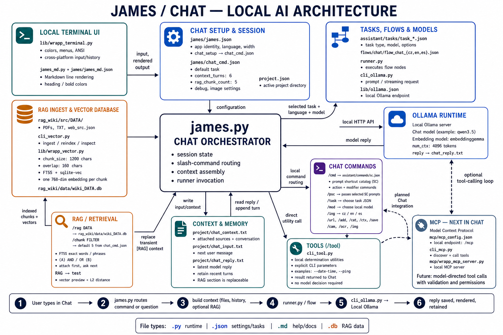

# James

James is a small cross-platform terminal workspace for the local Ollama tools in this repository. It provides a compact menu for Chat, Flows, databases, RAG, MCP modules, configuration, and Cowork agent sessions.


## Chat architecture

The following overview maps the central Chat orchestrator to terminal
rendering, settings, tasks and flows, local Ollama, prompt shortcuts, context,
RAG, direct tools, and the local MCP modules that can be used alongside Chat.



## Run it

From the repository root:

```text
python james.py
```

The active project is selected in `project.json`. General James settings—language, terminal width, and database location—are in [james.json](james.json), which points to the Chat setup through `chat_setup: "chat_cmd.json"`. Chat defaults are in [chat_cmd.json](chat_cmd.json), flow lists are in [james_flows.json](james_flows.json), and Markdown renderer colours are in [../lib/wrapp_md.json](../lib/wrapp_md.json).

The `colors` object in `wrapp_md.json` lets you recolour rendered Markdown without changing Python: `col_bold` controls `**bold**`, `col_italic` controls `*italic*`, and `col_code` controls inline `` `code` ``.

## Current capabilities

- **Chat:** Maintains a project-local conversation context and supports URL, file, camera, OCR, image-description, clipboard, search, export, import, and local-tool actions.
- **Chat commands:** Local commands control the Chat session, its context, files, camera, OCR, RAG, model, and export/import actions. See [chat_cmd.md](chat_cmd.md).
- **Prompt shortcut commands:** Commands from [`assistant/commands/sc.json`](../assistant/commands/sc.json) can be used in chat or flows. One primary command may be chained with compatible modifiers, for example `/tldr /list /md`. `/tldr` and `/wtf` work on the latest saved reply, or on an optional UTF-8 project file, without conversational context; other bare catalog commands apply to the current chat context. See the generated [English catalog](../assistant/commands/README.md) and [Czech catalog](../assistant/commands/sc_cz.md).
- **Flows:** Runs validated local Python CLI workflows from the repository `flows/` directory.
- **Database:** Browses and filters completed local tasks and answers.
- **RAG:** Configures, builds, and uses local knowledge bases from project sources.
- **MCP:** Opens independent local MCP modules (plugin-like services), their setup, and their available tools.
- **Cowork:** Starts scoped local agent sessions for light work, coding, or external hardware.


## Documents and configuration

| Resource | Purpose |
| --- | --- |
| [james_help.md](james_help.md) | Main-menu help and implementation/library notes. |
| [../lib/wrapp_md.py](../lib/wrapp_md.py) | Reusable compact Markdown terminal renderer used by James text pages and Chat replies, including fenced code blocks. |
| [../lib/wrapp_md.json](../lib/wrapp_md.json) | Renderer-specific Markdown colours. |
| [james_flows.json](james_flows.json) | Flow lists grouped by the James Flow menu categories; every entry names an existing `flows/*.txt` file. |
| [chat_cmd.md](chat_cmd.md) | Chat commands: the local command reference for a Chat session. |
| [chat_cmd.json](chat_cmd.json) | Chat defaults for a new session (task, retained context turns, and debug), plus camera/export settings; OCR/image-description task, slash-command, and language settings; localized context-command fallback text; and the internal `flows/chat/` template for `/tldr` and `/wtf`. |
| [agents.json](agents.json) | Declarative Cowork agent profiles: label, model, local generation options, and allowed tool profile. |
| [../assistant/commands/README.md](../assistant/commands/README.md) | Prompt shortcut command catalog in English, generated from [`sc.json`](../assistant/commands/sc.json). |
| [../assistant/commands/sc_cz.md](../assistant/commands/sc_cz.md) | Prompt shortcut command catalog in Czech, generated from [`sc.json`](../assistant/commands/sc.json). |
| [about.md](about.md) | English About page shown for English and Spanish UI settings. |
| [about_cz.md](about_cz.md) | Czech About page shown for the Czech UI setting. |
| [todo_cowork_cz.md](todo_cowork_cz.md) | Czech proposal and future checklist for the Cowork workspace. |
| [../assistant/spec/agent_mcp_hw_cz.md](../assistant/spec/agent_mcp_hw_cz.md) | Czech design, safety boundaries, and implementation checklist for the external-hardware MCP module. |

## Chat commands and context workflow

Chat state lives in the active project directory. The most useful commands are:

```text
/hlp                Show the local Chat-command help.
/clr                Clear the context buffer and start a new conversation.
/task [TASK.json]   List available task JSON files, or change the Chat flow task for this session; the default is task_base.json.
/add FILE          Attach a UTF-8 project file.
/cat               Show the main `chat_context.txt` with Markdown rendering, without adding it to context.
/cat FILE          Show a UTF-8 project file without adding it to context; render `.md` as Markdown.
/cam [FILE]        Capture a camera image.
/ocr [FILE]        Extract image text and attach it as [OCR].
/img [FILE]        Describe an image, attach it as [IMAGE], and retain it for follow-up vision questions.
/mod               List local Ollama models and highlight the active Chat model.
/lng [LANGUAGE]    List Chat languages, or switch this Chat session to cz, en, or es.
/proj [SUBDIR]     Show parsed project.json, or temporarily switch the active project directory without modifying project.json.
/rag DATA          Select `rag_wiki/data/wiki_DATA.db` for this Chat session; `/rag off` disconnects it.
/chunk FILTER[, FILTER ...]
                  Retrieve and attach the configured number of local chunks (5 by default), then show them. Comma-separated phrases use AND; `(phrase) and/or (phrase)` and `#(phrase)` let you choose the operator. Enter the chat question on the next line.
/ask FILTER :: QUESTION
                  Perform semantic vector retrieval, attach the configured chunks, and submit QUESTION immediately.
/cmd               Show the localized slash-command catalog with James Markdown colors.
/files or /ls      List files in the active project directory and its subdirectories.
/ctx               Show context size and counts.
/src               List attached sources.
/last              Show the latest saved reply with James Markdown colors.
/save [FILE]       Export the current context.
/load FILE         Replace the current context.
/debug [on|off]    Show or set chat diagnostics; on preserves live runner output, timings, and executed commands.
/tldr [FILE]       Summarize the latest reply, or an optional project file.
/wtf [FILE]        Explain the latest reply, or an optional project file, in everyday language.
/tldr /list /md    Condense the latest reply as a Markdown list.
```

At the start of a Chat session, the active model is read from the selected task. `/task` switches to that task's model, while a later `/mod MODEL` overrides only the model; the task and model are both passed to the Chat flow.

Use `/hlp` inside Chat for the local Chat-command list and `/cmd` for the localized, rendered Prompt shortcut command catalog. Setup → Slash Commands provides the same catalog outside Chat.
On Linux, Chat explicitly keeps the current session's prompt history through GNU readline, so ↑ and ↓ recall earlier prompts.

## Database

Database is James's browser for the local history of completed tasks and answers. It is useful when you want to find a previous result, inspect its prompt and answer, narrow the history to a subset, or prepare a smaller copy for further work. The active database is configured by `main_db` in [james.json](james.json); the default is `data/tasks.db`.

From the main menu, open **Database** and use the arrows and Enter to choose:

- **List** to browse saved records. Open a record to inspect it and use its available actions, such as rating or deleting the selected record.
- **Filter** to limit the browser by a stored field or date range.
- **Clone** to create a separate database containing selected records or starred records, leaving the active database unchanged.

The underlying command-line tool is [cli_db.py](../cli_db.py); its task schema is [data/tasks_db.md](../data/tasks_db.md). Database browsing changes data only when you explicitly use a record action or create a clone.

## RAG

RAG (retrieval-augmented generation) is James's local knowledge-base module. It lets Chat use selected passages from a local document collection as temporary source context. Unlike MCP, RAG does not expose a service or a raw tool capability: it builds and selects local vector databases, then adds only the retrieved passages to the current Chat request. Use it for questions whose answer should be grounded in project documents rather than only in the model's general knowledge.

To create a collection, place source files in `rag_wiki/src/NAME`, then open **RAG** → **ingest** in James. James builds `rag_wiki/data/wiki_NAME.db`, registers the profile in [rag_wiki/databases.json](../rag_wiki/databases.json), and selects it as the active wiki. Re-running ingest lets you update changed sources or overwrite and rebuild the collection.

In Chat, select a prepared wiki and retrieve the passages you need before asking the question:

```text
/rag NAME
/chunk search phrase
Ask the question that should use those chunks.
/rag off
```

`/chunk` attaches only the retrieved chunks to the current Chat context. Its count is always `defaults.rag_chunk_count` from `chat_cmd.json` (5 by default). `/rag off` removes this transient RAG context. **RAG** → **test** is a read-only vector-retrieval demonstration: it asks for a wiki name, preview length, result count, and a search phrase; it then renders the matching short chunks and their vector distances. It accepts the Chat-style `(A) and/or (B)` notation, but uses its phrases as one semantic vector query; exact Boolean filtering remains the FTS5 behavior of Chat `/chunk`. The menu also exposes the vector configuration, registered databases, and source/data directory tree. For the standalone workflow and data design, see [cli_vector.md](../rag_wiki/cli_vector.md), [vector_db_cz.md](../rag_wiki/vector_db_cz.md), and [rag_schema.md](../rag_wiki/rag_schema.md).

For a visual diagnostic outside Chat, run `python .\cli_vector.py --db btc --svg "bitcoin mining, hardware wallet"`. It writes `rag.svg` to the active project. The map uses word and chunk nodes; each labelled edge is that word's L2 vector distance from the chunk, and the 2D position is an approximation that minimises the relative edge-length error. Use `--svg-k 5` to choose the number of chunk nodes or `--svg-out NAME.svg` for another project-local file name.

## MCP

MCP (Model Context Protocol) is the interface through which an AI client can discover and call tools exposed by a server. James treats MCP integrations as independently standing, plugin-like local modules. A module owns its own server/configuration and optional dependencies; it can be present, absent, or still under construction without breaking the rest of James.

Open **MCP** from the main menu and choose a module:

- **MCP base** is the existing local Streamable HTTP service. Its submenu contains **run MCP server**, **list MCP services**, and **show MCP setup**. James reports the endpoint and does nothing if that server is already running.
- **MCP hardware** is the independent stdio service for configured external hardware. Its submenu lists only its allowlisted tools, shows [mcp/hw_server.json](../mcp/hw_server.json), and shows [requirements_ble.txt](../requirements_ble.txt). The server currently exposes `hardware_list_devices` and `hardware_run_action`; it does not expose raw BLE scans, UUIDs, payloads, addresses, or `.env` secrets. See [agent_mcp_hw_cz.md](../assistant/spec/agent_mcp_hw_cz.md) for the contract and safety model.
- **MCP Nostr** is a policy-guarded local stdio service. Its submenu lists its tools, shows [mcp/nostr_server.json](../mcp/nostr_server.json), and shows [requirements_nostr.txt](../requirements_nostr.txt). Listing tools starts no relay synchronization or outbound Nostr action. The service exposes status, diagnostics, contact and message inspection, controlled synchronization, and explicitly authorized replies or sends; its local policy is configured in [cli_nostr.json](../cli_nostr.json).

**Flows** → **MCP Nostr** also provides two CLI diagnostics: `flow_nostr_doctor.txt` only reports local configuration, pinned relays, and library versions; `flow_nostr_test.txt` additionally checks the configured public relays and fetches up to three public stream notes with `cli_nostr.py -s`. `flow_nostr_send_msg.txt` is an explicit delivery test that attempts to send its fixed message to the configured contact `agama`.

Modules are deliberately optional. For example, a clone without `cli_ble.py` or `requirements_ble.txt` can still use Base MCP, Chat, RAG, and Cowork. When an optional module is incomplete, James shows the exact missing project files and returns to the menu rather than importing it or failing.

The Base endpoint is defined in [mcp/mcp_config.json](../mcp/mcp_config.json). For direct tests or model tool-calling integration, use [cli_mcp.py](../cli_mcp.py); it selects an independent module with `--server-config`, for example `mcp/hw_server.json`. The protocol and project notes are in [mcp/mcp.md](../mcp/mcp.md) and [mcp/mcp2_cz.md](../mcp/mcp2_cz.md). Review the relevant server configuration before enabling tools that can access files or external services.

## Cowork

Cowork is James's local agent-session workspace. It keeps a session's model, project scope, tool policy, and recent turns while Cowork is open; those interactive choices are session-local and are not written back to the project configuration. Its entry screen offers three intentional starting profiles from [agents.json](agents.json):

- **Light AGENT session** uses small, read-oriented local tools for concise project work.
- **Coding session** uses the extended coding tool profile and keeps the larger default context for implementation work.
- **Agent working with hardware** combines its limited local diagnostics with the named hardware actions. It has no shell, Python runner, raw BLE command, UUID, payload, or secret-reading capability; hardware execution remains constrained to the allowlist in `devices.json`.

Each profile can declare its own Ollama model and options. Omitted values inherit the defaults from [../cli_agent.json](../cli_agent.json), so a project can tune an individual profile without duplicating the common agent settings. The hardware profile is intentionally not an MCP client: its two hardware tools call the same local allowlist layer as `mcp/hw_mcp_server.py`, preventing a second, unrestricted BLE path.

## Scope and boundaries

James orchestrates existing local CLIs; it does not replace their task configuration. The general `--context` behaviour of `cli_ollama.py` remains a reference-input mechanism for standalone CLI calls and flows. The convenience behaviour for a bare Prompt shortcut command (`/COMMAND`) is deliberately implemented only in the James Chat layer.
