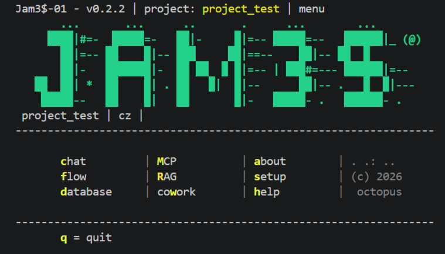
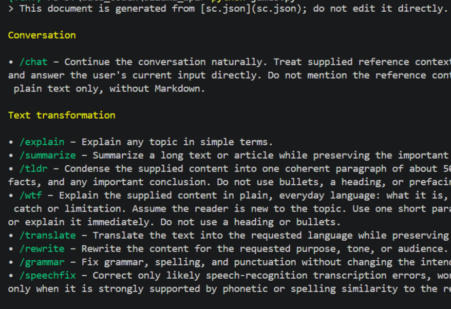

# James

James is a cross-platform terminal workspace for the local Ollama tools in this repository. It provides a compact menu for chat, flows, databases, RAG, MCP, configuration, and future Cowork work.



## Run it

From the repository root:

```text
python james.py
```

The active project is selected in `project.json`. James settings, including language, terminal width, colours, chat model, and flow lists, are in [james.json](james.json).

## Current capabilities

- **Chat:** Maintains a project-local conversation context and supports URL, file, camera, OCR, image-description, clipboard, search, export, import, and local-tool actions.
- **Slash commands:** Commands from `assistant/commands/sc.json` can be used in chat or flows. A bare catalog command such as `/tldr` or `/wtf` applies the selected command to the complete current chat context.
- **Flows:** Runs validated local Python CLI workflows from the repository `flows/` directory.
- **Database:** Browses and filters completed local tasks and answers.
- **RAG:** Configures and uses local knowledge bases from project sources.
- **MCP:** Starts the local Model Context Protocol server and lists its available services.
- **Cowork:** Present in the menu as a future agent-coordination workspace; its current concept is documented below.



## Documents and configuration

| Resource | Purpose |
| --- | --- |
| [james.md](james.md) | Short technical overview of James and its menu. |
| [james_help.md](james_help.md) | Main-menu help and implementation/library notes. |
| [chat_cmd.md](chat_cmd.md) | Chat-local command reference. |
| [chat_cmd.json](chat_cmd.json) | Chat command settings: camera and export defaults, image tasks, and localized context-command fallback text. |
| [about.md](about.md) | English About page shown for English and Spanish UI settings. |
| [about_cz.md](about_cz.md) | Czech About page shown for the Czech UI setting. |
| [todo_cowork_cz.md](todo_cowork_cz.md) | Czech proposal and future checklist for the Cowork workspace. |

## Chat context workflow

Chat state lives in the active project directory. The most useful commands are:

```text
/add FILE          Attach a UTF-8 project file.
/cam [FILE]        Capture a camera image.
/ocr [FILE]        Extract image text and attach it as [OCR].
/img [FILE]        Describe an image and attach it as [IMAGE].
/ctx               Show context size and counts.
/src               List attached sources.
/save [FILE]       Export the current context.
/load FILE         Replace the current context.
/tldr              Summarize the current context with the catalog command.
/wtf               Explain the current context in everyday language.
```

Use `/hlp` inside Chat for the full local command list. Use Setup → Slash Commands for the generated catalog reference.

## Scope and boundaries

James orchestrates existing local CLIs; it does not replace their task configuration. The general `--context` behaviour of `cli_ollama.py` remains a reference-input mechanism for standalone CLI calls and flows. The convenience behaviour for a bare `/COMMAND` is deliberately implemented only in the James Chat layer.
