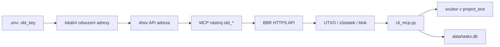

# MCP pro OBT / BBR API

Tento dokument popisuje lokální MCP rozšíření pro výukový projekt **One Byte
Toy (OBT)** a jeho BBR API. Implementace je v `lib/mcp_obt.py`, registrace do
lokálního MCP serveru v `mcp/wrapp_mcp_server.py` a ukázkový tok v
`tasks_flows/flow_mcp_obt_test.txt`.

> OBT, ESS251 a BBR jsou didaktické mechanismy. Nejde o skutečnou
> kryptoměnu ani bezpečné úložiště klíčů. Nikdy sem nevkládat klíč používaný
> pro reálná aktiva.

## Co MCP přidává

MCP převádí OBT API na lokální nástroje s názvy `obt_*`. Aplikace, agent nebo
`cli_mcp.py` je může nejprve vypsat, zavolat a jejich textový výsledek uložit.



Privátní skalár zůstává na lokálním počítači. Nástroj z něj vypočítá veřejný
bod na křivce ESS251 a čtyřznakovou hexadecimální adresu, například `0a4c`.
Do BBR API se posílá pouze odvozená adresa v cestě požadavku.

## OBT a BBR API

Výchozí API adresa je:

```text
https://www.agamapoint.com/bbr/index.php
```

Všechny čtecí požadavky sestavuje modul ve tvaru:

```text
GET ?route=<route>&api_key=<hodnota>
Accept: application/json
Cache-Control: no-cache
```

`api_key` se připojuje pro aktuální verzi endpointu. Jeho hodnotu lze změnit
proměnnou prostředí `OBT_API_KEY`; výchozí hodnota je uložena pouze v kódu
modulu pro tento výukový endpoint. Základní URL lze přesměrovat proměnnou
`OBT_API_BASE_URL`.

Nejdůležitější route je `get_balance/{address}`. BBR vrací stav autoritativní
pro tento testovací backend, například:

```json
{
  "status": "ok",
  "address": "83ca",
  "balance": 8,
  "utxo_count": 2,
  "unspent_outputs": [
    {"txid": 1234, "value": 3},
    {"txid": 1238, "value": 5}
  ]
}
```

`balance` je součet nezaplacených výstupů. Jeden UTXO obsahuje identifikátor
`txid` a hodnotu `value`.

OBT wallet rozlišuje dvě adresy:

- **API adresa:** přesně čtyři hex znaky, například `0a4c`; tu vyžaduje BBR.
- **Toy32 adresa:** zobrazený tvar jako `a1...`; je určen pro UI a do těchto
  API route se neposílá.

Referenční dokumentace: `obt_cip/obt_api.md`, `obt_cip/obt_address.md` a
`obt_cip/ess251.js`.

## Privátní klíč a `.env`

V kořeni projektu je lokální soubor `.env`:

```dotenv
obt_key=111
```

`.env` je v `.gitignore`, proto se nemá dostat do commitu. Šablona bez
osobního nastavení je `.env.example`.

Nástroje, které potřebují klíč, hledají hodnotu v tomto pořadí:

1. argument MCP `private_key`, pokud je předán;
2. proměnná procesu `obt_key`;
3. kořenový soubor `.env`.

Povolené hodnoty jsou celá čísla `1` až `251`. Klíč je vhodné držet v `.env`,
nikoliv ve flow, příkazové historii, souboru s výsledkem ani databázovém
záznamu. Argument `private_key` slouží jen pro krátké izolované testy.

## Seznam MCP nástrojů

| Nástroj | Argumenty | BBR route | Výsledek |
| --- | --- | --- | --- |
| `obt_get_address` | `private_key` nepovinně | žádná | Čtyřhexová API adresa. |
| `obt_get_utxo` | `private_key` nepovinně | `get_balance/{address}` | Formátovaný JSON s adresou, UTXO, počtem a zůstatkem. |
| `obt_get_balance` | `private_key` nepovinně | `get_balance/{address}` | Pouze číslo zůstatku, například `20`. |
| `obt_get_last_block` | — | `get_last_block` | Poslední blok. |
| `obt_get_block` | `block_id` kladné celé číslo | `get_block/{id}` | Jeden blok. |
| `obt_get_blocks` | — | `get_blocks` | Až 20 posledních bloků. |
| `obt_get_tx_raw` | `txid` kladné celé číslo | `get_tx_raw/{txid}` | Plochá reprezentace transakce. |
| `obt_get_tx` | `txid` kladné celé číslo | `get_tx/{txid}` | Didaktická reprezentace transakce s `vin` a `vout`. |
| `obt_build_transaction` | `to`, `amount`, nepovinně `utxo_txid` | `get_balance/{address}` | Vybere UTXO, vytvoří raw zprávu, ASH24 a `sig_hex`; nic neodesílá. |
| `obt_send_transaction` | `transaction`, `confirm=true` | `send_transaction` (POST) | Znovu ověří podpis a aktuálnost UTXO, potom odešle přesný payload. |

Čtecí nástroje stav nemění. Transakční nástroje oddělují sestavení od
broadcastu; `obt_send_transaction` vyžaduje přesně `confirm=true` a je jediný
název, který provede POST.

## Vypsání nástrojů

Aktivujte virtuální prostředí a vyžádejte seznam nástrojů lokálního MCP
serveru:

```powershell
.\venv\Scripts\python.exe cli_mcp.py --list --no-db
```

Výpis obsahuje také dřívější lokální nástroje (`rot13`, `datetime`,
`calculate`). OBT nástroje lze filtrovat podle prefixu `obt_` v terminálu
nebo v souboru s výstupem:

```powershell
.\venv\Scripts\python.exe cli_mcp.py --list --out mcp_obt_tools.txt --no-db
```

Soubor se uloží do aktivního projektového adresáře, po nastavení flow tedy do
`project_test/mcp_obt_tools.txt`.

## Přímé ukázky použití

### Odvození adresy

Bez argumentů se načte `obt_key` z `.env`:

```powershell
.\venv\Scripts\python.exe cli_mcp.py --function obt_get_address --args "{}" --no-db
```

Izolovaný test lze provést explicitním klíčem. Tento klíč se ale objeví v
historii shellu, proto jej nepoužívat pro běžnou práci:

```powershell
.\venv\Scripts\python.exe cli_mcp.py --function obt_get_address --args '{"private_key": 1}' --no-db
```

### UTXO včetně zůstatku

```powershell
.\venv\Scripts\python.exe cli_mcp.py --function obt_get_utxo --args "{}" --out obt_utxo.json --no-db
```

Výstup je JSON. Obsahuje kompletní seznam UTXO, takže se hodí pro kontrolu
nebo následný výběr konkrétního `txid`.

### Jen číselný zůstatek

```powershell
.\venv\Scripts\python.exe cli_mcp.py --function obt_get_balance --args "{}" --out obt_balance.txt
```

Výstup nástroje je třeba jen jeden řetězec obsahující číslo. `cli_mcp.py` jej
vypíše zeleně pomocí `Terminal().g(...)`, zapíše do
`project_test/obt_balance.txt` a — bez přepínače `--no-db` — přidá odpověď do
`data/tasks.db`.

Záznam databáze má po nastavení selectorem `mcp_obt` například:

- `selector`: `mcp_obt`
- `task`: `mcp/obt_get_balance`
- `answer`: aktuální číselný zůstatek
- `parameters`: volaná MCP funkce, argumenty, endpoint a cesta k výstupu

## Testovací flow

`tasks_flows/flow_mcp_obt_test.txt` provádí těchto šest kroků:

1. nastaví aktivní adresář `project_test`;
2. nastaví databázový selector `mcp_obt`;
3. vyčistí `project_test/log.txt`;
4. uloží seznam MCP nástrojů do `mcp_obt_tools.txt`;
5. načte detailní UTXO do `obt_utxo.json` bez zápisu do DB;
6. načte samotný zůstatek do `obt_balance.txt`, zobrazí jej zeleně a uloží do
   databáze.

Spuštění:

```powershell
.\venv\Scripts\python.exe runner.py flow_mcp_obt_test.txt
```

Nejprve lze ověřit jen syntaxi a cesty bez volání API:

```powershell
.\venv\Scripts\python.exe runner.py flow_mcp_obt_test.txt --dry-run
```

## Předání zůstatku dalšímu kroku

Runner nepřenáší stdout mezi příkazy jako proměnnou. Přenosovým rozhraním je
proto soubor `project_test/obt_balance.txt`, který obsahuje přesně číslo.

Pro jazykový úkol lze číslo předat do `cli_ollama.py` jako data:

```text
python3 cli_ollama.py --type task_obt_balance.json --data obt_balance.txt --out obt_operation.txt
```

Pro přesnou aritmetiku je vhodnější doplnit deterministický CLI nebo MCP
nástroj, který přečte `obt_balance.txt` a provede výslovně zadanou operaci
(porovnání limitu, násobení, vytvoření návrhu platby). LLM se nemá používat
tam, kde musí být číselný výsledek přesný.

## Sestavení a odeslání transakce

Transakce utrácí právě jeden UTXO. Kanonicky podepisovaný text je:

```text
from|utxo_txid|to|amount
```

Build nástroj provede ASH24, deterministický podpis ESS251 a lokální ověření.
Do plánu přidá `payload`, což je přesný objekt následně odesílaný na API:

```json
{
  "from": "0a4c",
  "to": "83ca",
  "val1": 3,
  "val2": 1,
  "sig_hex": "…",
  "utxo_txid": 12
}
```

Celý build JSON navíc obsahuje zobrazovací metadata `"api_key": "123"`.
Nejde o součást `payload`, podpisu ani POST těla; skutečný API klíč se připojuje
do URL parametru v klientovi.

`cli_mcp_tx.py` spojuje celý tok: vypíše zůstatek před odesláním, uloží a
vypíše podepsaný JSON, odešle tentýž objekt a nakonec znovu načte zůstatek.
Bez `--confirm` končí po bezpečném buildu.

```powershell
.\venv\Scripts\python.exe cli_mcp_tx.py --addr 83ca --val 1
.\venv\Scripts\python.exe cli_mcp_tx.py --addr 83ca --val 1 --confirm
```

První příkaz je dry-run. Druhý posílá testnetovou transakci. Ve flow
`tasks_flows/flow_mcp_tx.txt` je druhá forma zapsaná záměrně explicitně.
Výstupy jsou `obt_balance_before.txt`, `obt_transaction.json`,
`obt_broadcast.json` a `obt_balance_after.txt`; úspěšné kroky se zapisují do
`data/tasks.db` pod aktivním selectorem.

### Debugová ruční confirmace

Kořenový `project.json` může obsahovat volbu:

```json
"confirm": true
```

Je-li zapnutá, kombinace `--confirm` po sestavení a výpisu JSON zastaví flow.
Do interaktivního terminálu je nutné napsat jednu z hodnot:

```text
ok
```

nebo:

```text
yes
```

Na velikosti písmen nezáleží. Jiný vstup nebo Enter broadcast zruší. Při `"confirm": false` (nebo pokud
volba chybí) je `--confirm` neinteraktivní, což je zamýšlené pro budoucího
agenta a MCP automatizaci. Pokud je debugová confirmace zapnutá bez
interaktivního terminálu, nástroj bezpečně skončí chybou a nic neodešle.

## Chyby a omezení

- HTTP stav mimo 2xx, chyba sítě, neplatný JSON nebo `status` odlišný od `ok`
  ukončí MCP nástroj s popisnou chybou.
- Odpověď `get_balance` musí obsahovat seznam `unspent_outputs`; jinak nástroj
  odmítne pokračovat.
- Výchozí timeout čtecího API požadavku je 10 sekund.
- Stav zůstatku je proměnlivý. Výsledek flow je okamžitý snímek BBR API, ne
  potvrzení bloku ani účetní finalita.
- ESS251, ASH24, krátké klíče a serverový model jsou pouze výukové. Zejména
  je nutné považovat vzdálený backend za zdroj pravdy pro UTXO.
