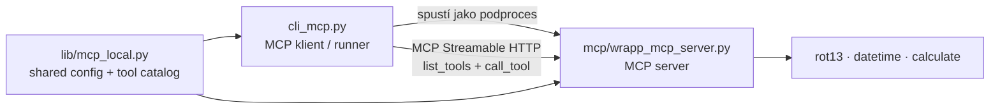
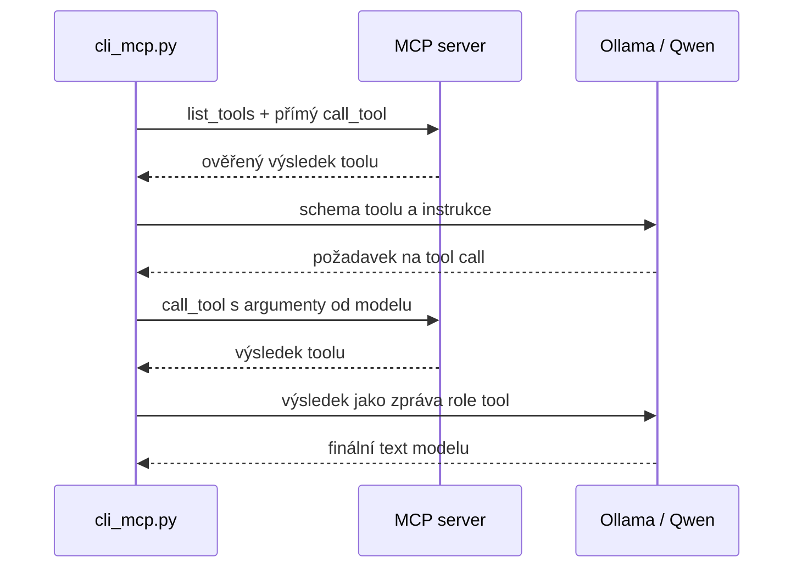

# Naše MCP integrace

Tento dokument popisuje konkrétní MCP řešení v tomto projektu. Je určený jako praktická mapa: co je protokol, které soubory hrají jakou roli, co přesně dělá `cli_mcp.py` a kdy se do běhu zapojuje Ollama s modelem Qwen.

## MCP stručně

**MCP (Model Context Protocol)** je komunikační protokol pro zpřístupnění nástrojů aplikacím s jazykovým modelem. Sám MCP není model, nástroj ani server. Určuje, jak spolu klient a server komunikují například při:

- zjištění dostupných nástrojů (`list_tools`),
- získání popisu parametrů nástroje,
- volání nástroje a předání jeho výsledku.

Model není povinnou součástí MCP. MCP klient může nástroj zavolat přímo, bez jakéhokoli LLM. Teprve při tool-callingu se model rozhoduje, který z nabídnutých nástrojů chce použít.

## Co máme napsáno

| Část | Soubor | Role |
| --- | --- | --- |
| MCP server | [`mcp/wrapp_mcp_server.py`](wrapp_mcp_server.py) | Lokální server, který registruje a publikuje naše tooly přes HTTP na `/mcp`. |
| Tool | [`mcp/rot13.py`](rot13.py) | Čistá funkce `rot13(word)`. |
| Tool | [`mcp/calculate.py`](calculate.py) | Čistá funkce `calculate(a, b, operation)`. |
| Tool | [`mcp/current_datetime.py`](current_datetime.py) | Čistá funkce `datetime()`. |
| Sdílený katalog | [`lib/mcp_local.py`](../lib/mcp_local.py) | Validace konfigurace lokálního serveru a deklarace toolů včetně bezpečných argumentů pro `--all`. |
| MCP klient / runner | [`cli_mcp.py`](cli_mcp.py) | Spustí server, připojí se k němu, najde a volá tooly. S `--ollama` je také prostředníkem mezi MCP a Ollamou. |
| Konfigurace Memory | [`mcp/memory_server.json`](memory_server.json) | Lokální stdio konfigurace pro referenční MCP Memory server. |
| Konfigurace Filesystem | [`mcp/filesystem_server.json`](filesystem_server.json) | Lokální stdio konfigurace pro Filesystem server omezený na `data_mcp`. |
| Konfigurace veřejného HTTP | [`mcp/website_spec_remote_server.json`](website_spec_remote_server.json) | Veřejný read-only Streamable HTTP server pro bezpečnou ukázku vzdáleného MCP. |
| Testovací data | [`data_mcp/`](../data_mcp/) | Vyhrazený testovací adresář pro ukázky Filesystem a Memory MCP. |
| Konfigurace serveru | [`mcp/mcp_config.json`](mcp_config.json) | Host, port, cesta `/mcp` a výchozí název modelu. |
| Konfigurace projektu | [`project.json`](project.json) | Aktivní projektový adresář, logování, selektor a přepínač ukládání do DB. |

Samotné soubory `rot13.py`, `calculate.py` a `current_datetime.py` nejsou MCP servery. Jsou to běžné Python funkce. Katalog [`lib/mcp_local.py`](../lib/mcp_local.py) určuje, které z nich jsou lokální MCP tooly a jaké mají bezpečné argumenty pro `--all`. Server z nich vytvoří veřejně volatelné MCP tooly registrací ve `wrapp_mcp_server.py`:

```python
for tool_spec in LOCAL_TOOL_SPECS:
    mcp.tool()(LOCAL_TOOL_IMPLEMENTATIONS[tool_spec.name])
```

## Role Python balíčku `mcp`

Instalovaný Python balíček `mcp` je SDK pro MCP; není to automaticky spuštěný server.

- V serveru používáme `mcp.server.fastmcp.FastMCP`.
- V klientovi používáme `mcp.ClientSession` a `streamable_http_client`.

Jedna knihovna tedy pomáhá implementovat obě strany protokolu. Vlastní server je až proces spuštěný z `mcp/wrapp_mcp_server.py`.

## Architektura běžného testu



`cli_mcp.py` nejdřív spustí náš server, počká na port, naváže MCP relaci, zavolá `list_tools()` a podle `--function` vybere nástroj. Potom nástroj volá přímo přes MCP. Po skončení server vždy ukončí.

Například pro kalkulačku proběhne zjednodušeně toto:

```text
cli_mcp.py
  → spustí wrapp_mcp_server.py
  → MCP initialize
  → MCP list_tools
  → MCP call_tool("calculate", {"a": 3, "b": 7, "operation": "*"})
  ← "21.0"
```

V tomto režimu není potřeba Ollama ani jazykový model.

## Role Qwen a Ollamy

`qwen3.5:latest` je jazykový model uložený a provozovaný v Ollamě. Není to MCP server, MCP klient ani Python modul `mcp`.

Model nepotřebuje mít nainstalovaný Python balíček `mcp`. Naše CLI mu při režimu `--ollama` pošle JSON schema toolu. Model pak vrátí strukturovanou žádost o jeho volání. `cli_mcp.py` tuto žádost přečte, provede skutečné volání přes MCP server a výsledek doručí modelu zpět.



Ne každý model v Ollamě umí tool-calling spolehlivě. Pro režim `--ollama` je potřeba model, který vrací `tool_calls` ve formátu API `/api/chat`. Přímý MCP test bez `--ollama` na schopnostech modelu nezávisí.

## Příkazy a jejich rozdíl

### Vypsání toolů

```powershell
python3 cli_mcp.py --list
python3 cli_mcp.py -l --out tools.txt
```

Spustí MCP server, vypíše jeho nástroje a jejich popisy a skončí. Ollama se nevolá a záznam do DB se nevytváří. S `--out` se seznam uloží do aktivního projektového adresáře.

### Rychlý přímý MCP test — výchozí režim

```powershell
python3 cli_mcp.py --function calculate --a 3 --b 7 --operation "*"
python3 cli_mcp.py --function rot13 --word apple --out mcp_out.txt
python3 cli_mcp.py --function datetime
```

To je výchozí a rychlý režim. CLI zavolá nástroj přímo přes MCP a po úspěchu:

- vytiskne diagnostický řádek s výsledkem,
- vytiskne samotný výsledek na samostatný zelený řádek,
- uloží samotný výsledek do `--out FILE`, je-li zadané,
- při `"db": true` v `project.json` uloží samotný výsledek do `data/tasks.db` do sloupce `answer`.

Příklad očekávaného výsledku:

```text
[čas] MCP calculation test result: 3.0 * 7.0 = 21.0
21.0
[čas] Task recorded in data/tasks.db: 123
[čas] MCP tool test: PASSED
```

Barevné zvýraznění závisí na tom, zda terminál podporuje ANSI barvy. Text v logu a souboru zůstává čistý, bez řídicích sekvencí.

V tomto režimu parametr `--model` Ollamu nevolá. Hodnota modelu se jen používá jako metadata případného DB záznamu; pro samotný výsledek `calculate` nebo `rot13` není podstatná.

### Rychlý přímý test všech lokálních toolů

```powershell
python3 cli_mcp.py --all --no-db
python3 cli_mcp.py --all --out all_tools.txt
```

`--all` jednou zavolá každý tool deklarovaný v [`lib/mcp_local.py`](../lib/mcp_local.py). Použije jeho explicitně uložené bezpečné argumenty: nyní `apple` pro `rot13`, `2`, `3`, `+` pro kalkulačku a prázdný objekt pro `datetime`. Je určený pro rychlou kontrolu po změně serveru; nelze jej kombinovat s `--ollama`, `--list`, `--args` ani s obecným `--server-config`, protože cizí servery nemají společný bezpečný význam parametrů.

Při `--out` vznikne jeden textový soubor, kde je každý řádek ve tvaru `tool: výsledek`. Při zapnuté DB se každý úspěšný tool zapíše jako samostatný úkol; `--no-db` toto vypne.

### Úplné ověření přes Ollamu — volitelné

```powershell
python3 cli_mcp.py --ollama --model qwen3.5:latest --function calculate --a 3 --b 7 --operation "*"
python3 cli_mcp.py --ollama --model qwen3.5:latest --function rot13 --word apple
```

Přepínač `--ollama` je výchozně vypnutý. Teprve s ním CLI po přímém MCP testu ještě ověřuje, zda model:

1. dostal schema zvoleného toolu,
2. skutečně požádal o jeho zavolání,
3. předal použitelné argumenty,
4. dostal výsledek toolu zpět,
5. dokázal vrátit finální textovou odpověď.

Tento režim může trvat podstatně déle, protože čeká na jednu nebo dvě odpovědi modelu přes Ollama API. `--out` se přesto zapíše hned po přímém MCP výsledku, tedy před případným dlouhým čekáním na finální odpověď modelu.

`--ollama` nelze kombinovat s `--list`.

### Strojový výstup, timeout a jednorázový běh

```powershell
python3 cli_mcp.py --function calculate --a 3 --b 7 --operation "*" --json --no-db
python3 cli_mcp.py --ollama --function rot13 --word apple --timeout 45
```

`--json` pošle na standardní výstup právě jeden JSON objekt. Obsahuje `tool`, `arguments`, `result`, `duration_seconds` a `status`; u `--all` je `result` pole výsledků jednotlivých toolů. Průběhové zprávy a chyby jdou v tomto režimu na standardní chybový výstup, takže lze stdout bezpečně předat jinému programu. `--out` i v JSON režimu nadále ukládá samotný textový výsledek toolu.

`--no-db` potlačí zápis do `data/tasks.db`, i když má aktivní `project.json` hodnotu `"db": true`. Neovlivňuje log ani `--out`.

`--timeout SECONDS` použije zadaný limit pro čekání na start a odpovědi MCP serveru i pro každou jednotlivou odpověď Ollamy. Bez přepínače zůstává zachováno původní chování: lokální MCP start čeká nejvýše 15 sekund a Ollama používá timeout z konfigurace projektu.

### Obecný externí MCP server

Přepínač `--server-config FILE` připojí `cli_mcp.py` k jinému MCP serveru. Konfigurační soubor musí být uvnitř tohoto projektu a podporuje dva transporty: `stdio` pro lokálně spuštěný proces a `streamable-http` pro vzdálený HTTP endpoint.

Pro lokální `stdio` server vypadá konfigurace například takto:

```json
{
  "transport": "stdio",
  "command": "npx",
  "args": ["-y", "@modelcontextprotocol/server-memory"],
  "cwd": "data_mcp",
  "create_cwd": true,
  "env": {
    "MEMORY_FILE_PATH": "${PROJECT_ROOT}/data_mcp/memory_flow.jsonl"
  }
}
```

Konfigurace používají pouze `npx` a relativní pracovní adresář, proto fungují ve Windows i Linuxu. Python MCP SDK na Windows vyřeší spustitelný příkaz `npx` bez nutnosti zapisovat do JSONu `cmd /c`. Je potřeba mít nainstalovaný Node.js a `npx`; při prvním běhu `npx` stáhne balíček daného serveru.

`--args JSON` předá zvolenému toolu libovolný JSON objekt. Je určený pro obecné servery, jejichž parametry neodpovídají našim zkratkám `--word`, `--a`, `--b` a `--operation`.

#### Memory

```powershell
python3 cli_mcp.py --server-config mcp/memory_server.json --list
```

Nejdřív je vhodné vypsat aktuální tooly. Pak lze volat jejich jméno a přesné argumenty ze schema, například:

```powershell
python3 cli_mcp.py --server-config mcp/memory_server.json --function create_entities --args '{"entities":[{"name":"test","entityType":"note","observations":["hello MCP"]}]}'
python3 cli_mcp.py --server-config mcp/memory_server.json --function search_nodes --args '{"query":"mcp_flow_demo"}' --json --no-db
```

Dodaná konfigurace ukládá graf do `data_mcp/memory_flow.jsonl`, nikoli do dočasné cache balíčku `npx`. Pokud `data_mcp` chybí, CLI jej při prvním spuštění vytvoří. Kompletní ukázka [`tasks_flows/flow_mcp_memory.txt`](../tasks_flows/flow_mcp_memory.txt) vytvoří malou entitu, v dalším volání ji vyhledá, v třetím ji otevře a poslední výsledek uloží přes `--out` do `memory_mcp_read.json` aktivního projektu.

#### Filesystem

```powershell
python3 cli_mcp.py --server-config mcp/filesystem_server.json --list
python3 cli_mcp.py --server-config mcp/filesystem_server.json --function list_allowed_directories
python3 cli_mcp.py --server-config mcp/filesystem_server.json --function read_text_file --args '{"path":"mcp_flow_example.txt"}' --json --no-db
```

Filesystém server dostává jako jediný povolený adresář `data_mcp` v kořeni projektu. Je to vyhrazený testovací prostor — server v něm může podle zvoleného toolu soubory číst, vytvářet, přepisovat, přesouvat i mazat. Nedávejme mu cestu k celému projektu ani k domovskému adresáři.
Konfigurace Filesystem serveru má `"create_cwd": true`, takže při příštím spuštění znovu vytvoří chybějící `data_mcp`; cesta přitom musí zůstat uvnitř tohoto projektu.
Parametr `path` je relativní vůči tomuto povolenému kořeni: použij `mcp_flow_example.txt`, nikoli `data_mcp/mcp_flow_example.txt`.

Kompletní připravená ukázka je [`tasks_flows/flow_mcp_filesystem.txt`](../tasks_flows/flow_mcp_filesystem.txt). Flow vytvoří `data_mcp/mcp_flow_example.txt` přes `write_file`, načte jej přes samostatné `read_text_file` volání a uloží přečtený obsah do `filesystem_mcp_read.txt` v aktivním projektovém adresáři. Takový výstupní soubor je jednoduché, průhledné rozhraní pro další CLI modul.

#### Veřejný Streamable HTTP server

Konfigurace [`mcp/website_spec_remote_server.json`](website_spec_remote_server.json) míří na `https://mcp.specification.website/mcp`. Je to veřejný read-only server pro materiály Website Specification; nevyžaduje účet, token ani skutečná osobní data. Hlavička `User-Agent` v konfiguraci je pouze kompatibilitní identifikace klienta, není to přístupový údaj.

```powershell
python3 cli_mcp.py --server-config mcp/website_spec_remote_server.json --list --timeout 45
python3 cli_mcp.py --server-config mcp/website_spec_remote_server.json --function get_categories --timeout 45 --json --no-db --out remote_mcp_categories.txt
```

Tool `get_categories` je bezparametrový a pouze čte veřejná data. Druhý příkaz vytiskne jeden JSON objekt na stdout, nezapíše DB a současně uloží samotný textový výsledek do `remote_mcp_categories.txt` aktivního projektu. Celá ukázka je připravená v [`tasks_flows/flow_mcp_remote_http.txt`](../tasks_flows/flow_mcp_remote_http.txt).

Jako jednoznačný vzdálený MCP „Hello World“ použijme pevné téma HTML doctype:

```powershell
python3 cli_mcp.py --server-config mcp/website_spec_remote_server.json --function get_topic --args '{"slug":"doctype"}' --timeout 45 --json --no-db --out remote_mcp_hello_doctype.md
```

Vstup je stabilní slug `doctype`; server vrátí celý veřejný text tématu a tím přímo sdělí ověřitelnou informaci, že HTML dokument začíná `<!doctype html>`. Připravený krok je v [`tasks_flows/flow_mcp_remote_http_example.txt`](../tasks_flows/flow_mcp_remote_http_example.txt). Výsledný soubor `remote_mcp_hello_doctype.md` může bez úprav načíst další CLI modul.

Vzdálená konfigurace může volitelně obsahovat objekt `headers` s textovými klíči a hodnotami. V tomto prvním kroku do něj nepatří tokeny, hesla ani URL obsahující osobní údaje; pro autentizované servery nejdříve doplníme oddělené bezpečné načítání tajemství.

`--server-config` se zatím nedá kombinovat s `--ollama`: tento krok ověřuje obecné přímé MCP volání. Tool-calling přes Ollamu pro cizí servery bude samostatné rozšíření.

## Výstupní soubor a databáze

Přepínač `--out FILE` vyžaduje název souboru:

```powershell
python3 cli_mcp.py --function rot13 --word apple --out mcp_out.txt
```

Samotné `--out` bez hodnoty je chyba parseru. Soubor musí být přímo v aktivním projektovém adresáři určeném položkou `subdir` v `project.json`; cesty mimo něj ani další vnořená podsložka nejsou povolené. Výstup používá UTF-8 s BOM, stejně jako `cli_ollama.py`.

Při zapnutém `"db": true` se po úspěšném testu vytvoří záznam v `data/tasks.db`. Důležité hodnoty jsou:

| Sloupec | Hodnota |
| --- | --- |
| `project` | Aktivní `subdir` z `project.json`. |
| `selector` | `selector` z `project.json`. |
| `task` | Například `mcp/calculate`. |
| `model` | Hodnota z `--model` nebo výchozí z `mcp_config.json`. |
| `parameters` | Endpoint, jméno toolu, argumenty a případně název výstupního souboru. |
| `answer` | Přímý a ověřený výsledek MCP toolu, například `21.0` nebo `NCCYR`. |

Pro jednorázové či diagnostické spuštění přidej `--no-db`; zápis se pak neprovede nezávisle na hodnotě v `project.json`.

## Konfigurace

[`mcp/mcp_config.json`](mcp_config.json) definuje lokální endpoint a výchozí model:

```json
{
  "host": "127.0.0.1",
  "port": 8000,
  "path": "/mcp",
  "transport": "streamable-http",
  "ollama_model": "qwen3.5:latest"
}
```

[`project.json`](project.json) určuje například, kde bude soubor z `--out`, zda se má psát log a zda se mají zaznamenávat výsledky do DB:

```json
{
  "subdir": "project_test",
  "selector": "mcp",
  "log": true,
  "debug": false,
  "db": true
}
```

## Praktické poznámky

- V PowerShellu i jiných shellech je bezpečné psát násobení jako `--operation "*"`, aby hvězdička nebyla rozbalena jako zástupný znak pro soubory.
- Přímý režim testuje MCP server a nástroj. Netestuje schopnost modelu používat nástroje.
- Režim `--ollama` testuje navíc model a lokální Ollama API. Je proto vhodný při změně modelu, aktualizaci Ollamy nebo při úpravě schema toolu.
- Pokud je port z `mcp_config.json` obsazený, CLI se zastaví, aby omylem nepoužilo cizí už spuštěný server.

## TODO / nice to have

Následující položky už jsou hotové nebo mohou integraci dále rozšířit:

- [x] Přidat `--no-db` pro jednorázový běh bez zápisu, i když má projekt v `project.json` `"db": true`.
- [x] Přidat `--json` pro strojově čitelný výsledek (tool, argumenty, výsledek, doba trvání, stav).
- [x] Přidat `--timeout` pro samostatné omezení čekání na MCP server a na jednotlivé odpovědi Ollamy.
- [x] Přidat `--all` pro rychlé přímé otestování všech lokálních toolů s předdefinovanými bezpečnými argumenty.
- [ ] Přidat automatické testy `cli_mcp.py` s testovacím MCP serverem a mockovanou Ollama odpovědí.
- [ ] V režimu `--ollama` porovnat finální text modelu s výsledkem toolu a jasně nahlásit, když model výsledek změní nebo doplní komentář.
- [x] Přidat vzdálený HTTP MCP endpoint jako další typ `--server-config`.
- [ ] Přidat `--ollama` také pro obecný `--server-config` režim.
- [ ] Zobrazit při `--list` i schema parametrů (`inputSchema`), nejen název a popis toolu.

## Přidání dalšího lokálního toolu

Při přidání dalšího toolu je vhodné provést tyto čtyři malé kroky:

1. Napsat čistou funkci do `mcp/`, bez HTTP, DB a Ollamy.
2. Přidat do `LOCAL_TOOL_SPECS` v [`lib/mcp_local.py`](../lib/mcp_local.py) její MCP název a bezpečný, nedestruktivní testovací vstup pro `--all`.
3. Přidat import a položku do `LOCAL_TOOL_IMPLEMENTATIONS` ve [`wrapp_mcp_server.py`](wrapp_mcp_server.py). Server tool zaregistruje podle katalogu automaticky.
4. Spustit `python3 cli_mcp.py --all --no-db`, případně přesný test s `--function` a `--args JSON`.

Katalog je mimo `wrapp_mcp_server.py` proto, že jej čte i klient. Nezávisí na MCP SDK a nespouští server; díky tomu funguje `cli_mcp.py --help` i bez aktivního MCP prostředí.
